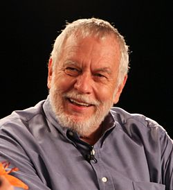

## Breakout - Part 3


Ship it! Nolan has given you the greeenlight. As the game testers(i.e. your friends/roommates/etc) help you take care of the final bugs and pass Quality Assurance testing there are only a few steps left before your game goes from the beta build to the final version!

## Step 1 - Documentation
While Nolan has given the greenlight, he wants to ensure the code is wrapped up. Nolan has required using 'Doxygen' <a href="http://www.doxygen.nl/">(Doxygen webpage)</a> or [Doxypress](https://www.copperspice.com/documentation-doxypress.html) to document the source code and automatically generate .html pages. 

**Your documentation should cover your classes and functions.**

An example of a well documented probjects using doxygen can be found here:

- https://www.ogre3d.org/docs/api/1.9/
- http://www.horde3d.org/docs/html/_api.html

### Doxygen style comments

Some examples of documentation are listed here: http://www.doxygen.nl/manual/docblocks.html A helpful tool to use may be: [Doxywizard](http://www.doxygen.nl/manual/doxywizard_usage.html)

Comments within code are in the style of:

```cpp
/*!
 * ... text ...
 */

/*!
 ... text ...
*/

//!
//!... text ...
//!

/*! \brief Brief description.
 *         Brief description continued.
 *
 *  Detailed description starts here.
 */

```

## Step 2 - Build (binary file)
You need to have a compiled binary of your game for your operating system (Either Windows, Mac, or Linux). You can assume a target audience of either a 64-bit Mac, Ubuntu Linux, or a Windows 10 machine. There should additionally be instructions about how to compile your code from source. The compilation should be trivial (running `python build.py` for example, or listing a series of `apt-get install` in a single command or a script you have built. **Make it trivial** so customers/TA's can easily build your project :) ).

## Step 3 - Post mortem
A post mortem in games is a look back at what could be improved. Write a brief (2-3 paragraphs) on what could be improved if you had an additional 8 weeks to work on this project. Where would you allocate time, what tools would you build, would you use any different tools, etc.

*Edit here a draft of your post mortem here if you like--the final copy goes in your 1-page .html website. Think of this section as a good 'reflection' for what you can improve on your next project you complete.*

My post mortem:
Things could be improved if I extra 8 weeks
- Better graphics with backgroup image, brick/paddle/ball texture. (1 day)
- Smooth mouse paddle control (1 day)
- Special bricks that generate items when broken, which takes effect when falls on the paddle (1 day)
- Various special item mechanics, for example, stretch or shorten the paddle, slow down or speed up the ball, make the paddle absorbing the ball and allow players do launch all the time, generate multiple balls, etc. (depends on the mechanic's implementation difficulty, could take up tp 2 weeks for rewriting the game's logic)
- add more levels, even chapters, make a new game process manager and UI for all level displays (1 to 2 week)
- add narratives (1 week)
- add particle effect and animations (like the fire effect on ball when the ball could penetrate through bricks, animations like the brick breaks :D)
- make a title screen and pause menu with clickable buttons (1 week)

## Step 4 - Website

Your documentation, a link to your binary, and your brief post mortem should be put together on a 1-page .html page. 

Additionally, provide a 1 minute video trailer followed by at least 3 screenshots of your game (order matters, video first, then screenshots below). This website will be the first place I look to grab your project files and binaries. 

[Please edit and put a link to your website here](./Game/README.md)

**Note**: I think it is incredibly important to build a portfolio of your game development works! You can re-use this template for your next project, and potentially other personal projects.
